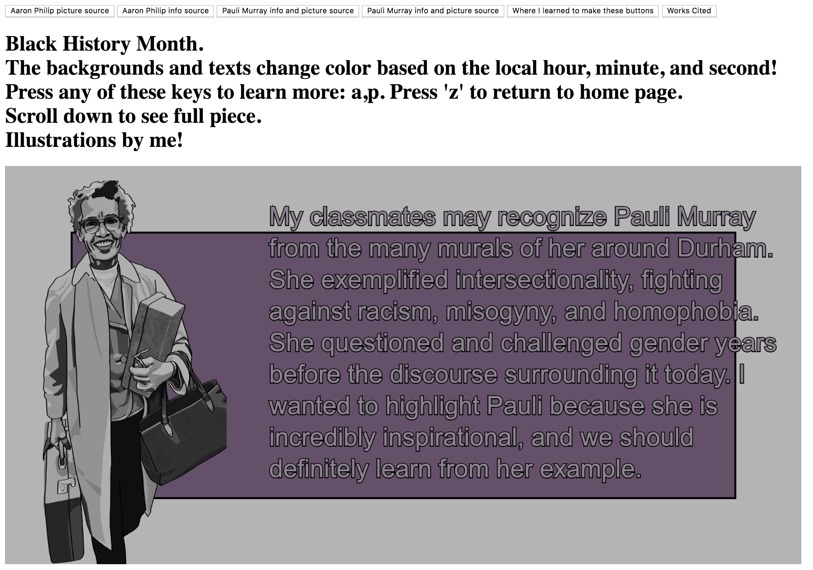

What inspired me to make this piece?

This semester I am focusing on building my technical artistic skills, but also learning more about my history.
I've always been invested in rights for black people and my communities histories and cultures, but I had never deeply
examined it from an academic perspective, which is why I am taking a class on it now. I also wanted to tie in black
history's importance to me in my artwork, and given that rotoscoping and illustration fascinate me, I decided to tie
in the skills I learned with traced illustrations of pictures I've found of each person.

What artworks is this piece in conversation with?

Of course, this piece is in conversation with the photographs I chose to trace. Photography is incredibly important
partially because of the histories it preserves. Furthermore, we can study whose histories photography has been 
utilized to preserve, and why those peoples have been chosen. I think that black people's lives being documented
(with consent) is powerful and impactful because I get to see people surviving and thriving in the past who look
like me, even though we aren't told much about black thriving and joy, especially in history. 
This piece is also inspired by installations you might find in a museum, for example, where you can click on several
pictures or texts in a "gallery" setting, and the screen zooms in to a blurb about a certain topic. The images on 
the screen also may shift around depending on which way the screen is tilted or depending on where you stand. I think
that the principle in animation to have objects always moving is useful for infographics because it keeps us 
engaged. 

What interactions have you developed for this piece and why?

This is a great segue from my last paragraph. I wanted to make the pictures and text sway depending on where you 
move your mouse. I think that, at least personally, I'm not always aware where my mouse is if it's not in my way and
I'm not using it, so personally interacting with this piece by making the objects move depending on your mouse's 
position creates a sense of connection and control with the piece for me. I also chose to include buttons and have
certain pages pop up when you press certain keys because I like its sort of minimalist aspect. Screens, unlike books,
only have one flat surface of a particular size. We usually can't flip physical screens to look at different webpages.
However, many websites utilize hyperlinks, or reactions to pressed keys, in order to keep things available but hidden,
to focus the user's attention on certain topics at a time. Hence, I included these functions in my piece to make the
information more digestible, and also draw more attention to my art instead of flooding the screen with everything at
once. I intended for this piece to be a place for discussion, focus, learning, and appreciation. 

What issues were you presented with when you were building this piece?

The code I wrote for this piece is very long and nested several times, so keeping track of where code is was 
frustrating at times. Furthermore, I also became frustrated when I was chosing what information to include, because
the people I included have done so many things in their lives and for their communities, and it's hard to discuss that
in such a small space. However, I still wanted to prioritize introduction to these figures and visual, artistic 
impact over informational quality. 

Bibliography:

Curtin, Frank C. Picture of Pauli Murray smiling at camera. WUNC 91.5: North Carolina Public Radio. Rao, Anita; Stasio, Frank. http://www.wunc.org/post/firebrand-and-first-lady
Iovannone, Jeffry J. "Pauli Murray: "Jane Crow"." Medium, 3 Jun. 2018. https://medium.com/queer-history-for-the-people/pauli-murray-jane-crow-6f38afaadaaf.
Philip, Aaron. "girl, interrupted." Instagram, 7 Jan. 2019, https://www.instagram.com/aaron___philip/?hl=en.
Philip, Aaron. "I'm a Black, Trans, Disabled Model - And I Just Got Signed to a Major Agency." them., 4 Sept. 2018, https://www.them.us/story/aaron-philip-signed-to-modeling-agency.